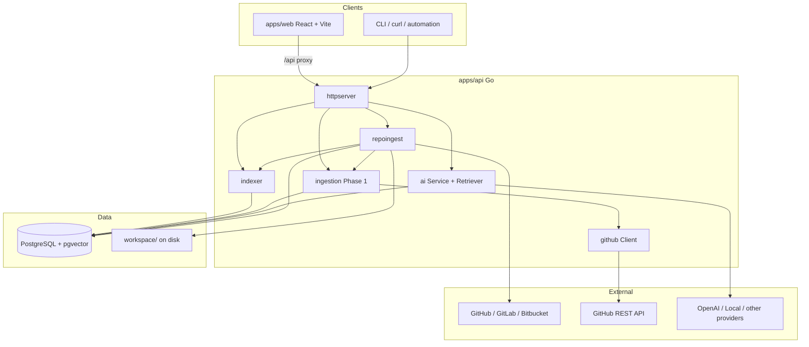

# CodeAtlas Architecture

> Full detail: [docs/architecture/overview.md](docs/architecture/overview.md)

## Purpose

CodeAtlas answers **architecture intelligence** questions for a codebase: what depends on what, who owns fragile areas, where churn concentrates, and what changes would break downstream modules. It is **not** an IDE copilot or generic doc generator—the **semantic graph** drives retrieval, visualization, and AI context.

## High-level system

## Core principles

1. **Graph-first** — Files, symbols, dependencies, and socio edges are stored relationally and queried together.
2. **Progressive enrichment** — Code map becomes usable before embeddings or GitHub history finish.
3. **Contract-first APIs** — JSON handlers in `internal/httpserver`; shared TS types in `packages/shared-types`.
4. **Observable ingestion** — Structured logs (`slog` JSON) and `socio_ingestion_runs` / `steps` tables.
5. **No hidden coupling** — Explicit packages under `internal/`; no framework magic beyond standard library HTTP.

## Major modules

| Module | Path | Responsibility |
|--------|------|----------------|
| HTTP server | `apps/api/internal/httpserver` | Routes, CORS, SSE chat |
| Repo ingest | `apps/api/internal/repoingest` | Clone/ZIP, status, delete/reindex |
| Indexer | `apps/api/internal/indexer` | Tree-sitter scan, graph + embeddings |
| Graph hierarchy | `apps/api/internal/graphhierarchy` | Cluster layers for map navigation |
| AI | `apps/api/internal/ai` | RAG retrieval, prompts, chat/stream |
| Providers | `apps/api/internal/ai/providers` | LLM vendor adapters |
| Socio store | `apps/api/internal/socio` | Metrics, ownership, overlays |
| GitHub client | `apps/api/internal/github` | REST with retry/backoff |
| Socio ingestion | `apps/api/internal/ingestion` | Phase 1 GitHub history |
| Web workspace | `apps/web/src/App.tsx` | Repo onboarding, map, inspector, chat |
| Hierarchy graph | `apps/web/src/components/HierarchyGraph.tsx` | React Flow + ELK layout |
| Socio panels | `apps/web/src/components/SocioPanels.tsx` | Ownership, hotspots, status |

## Authentication

**There is no end-user authentication** in the current codebase. The API is open on the network interface it binds to; browsers are restricted by **CORS** only. See [docs/security/overview.md](docs/security/overview.md).

## Deployment status

Only **local development** artifacts are checked in (`docker-compose.yml` for Postgres, `Makefile`). Production topology is documented as **assumptions** in [docs/deployment/production.md](docs/deployment/production.md).

## Related documents

- [docs/architecture/data-flow.md](docs/architecture/data-flow.md)
- [docs/architecture/sequence-diagrams.md](docs/architecture/sequence-diagrams.md)
- [API_REFERENCE.md](API_REFERENCE.md)
