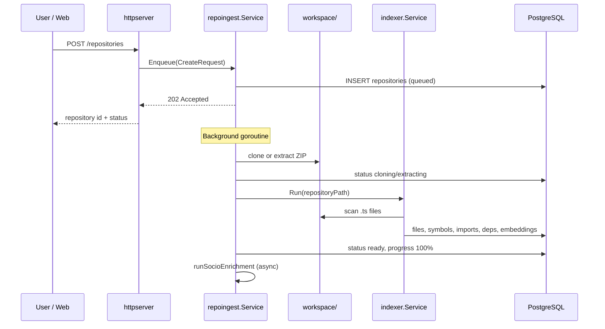
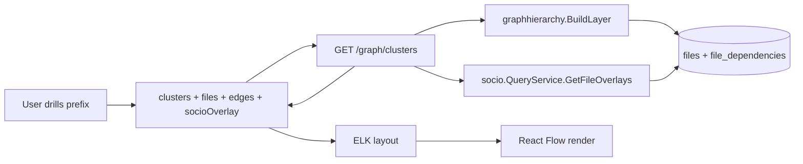
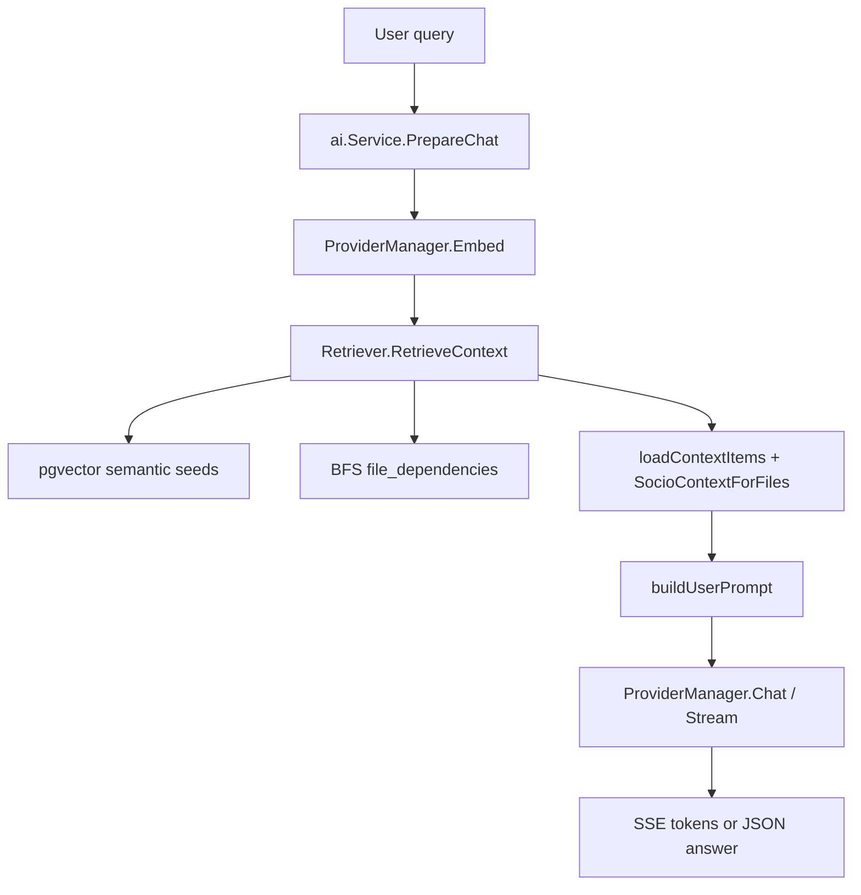
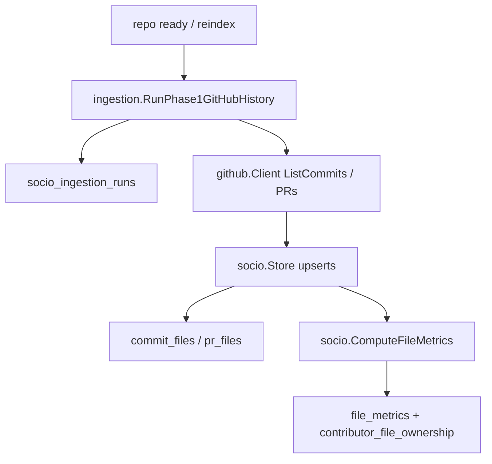

# Data Flow

## 1. Repository onboarding (code graph)

**Files:** `internal/repoingest/service.go`, `internal/indexer/service.go`, `internal/indexer/postgres_store.go`.

## 2. Graph visualization

**Why overlays on clusters response:** Keeps one round-trip for map paint; overlays keyed by `fileId` string.

## 3. AI architecture chat (Graph RAG)

**Context budget:** `AI_CONTEXT_TOKEN_BUDGET` (default 7000) trims prompt blocks in `internal/ai/prompt.go`.

**Socio in prompt:** Owner, bus factor, churn, risk, hotspot flags per file when `file_metrics` exist.

## 4. Socio-technical Phase 1 (GitHub)

**Skip conditions (implemented):**

- `source_type != github` → run marked `skipped`
- `GITHUB_TOKEN` empty → `skipped`
- Invalid GitHub URL → `failed`

## 5. Frontend state flow

| State | Storage | Purpose |
|-------|---------|---------|
| `repositories` | React `useState` | Repo list from `GET /repositories` |
| `activeRepoId` | React `useState` | Selected workspace scope |
| `selectedFileId` | React `useState` | Inspector + AI grounding |
| `favorites` | `localStorage` | `codeatlas:fav-repos` |
| `chatMessages` | React `useState` | In-memory session |
| `socioIngestion` | React `useState` | From `SocioPanels` callback |

No Redux/Zustand—local component state with polling intervals (4s repos, 1.5s progress, 5s socio).

## 6. Python `apps/ai` service

**Current data flow:** None into the Go stack. `apps/ai` exposes `GET /health` only. **Assumption:** Reserved for future Python-specific ML workloads or separated embedding service.
