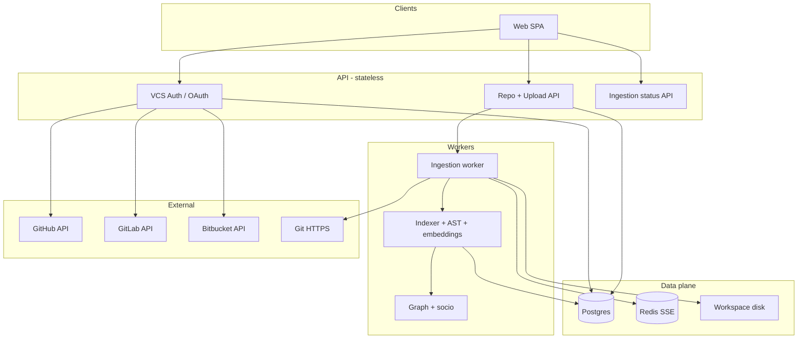
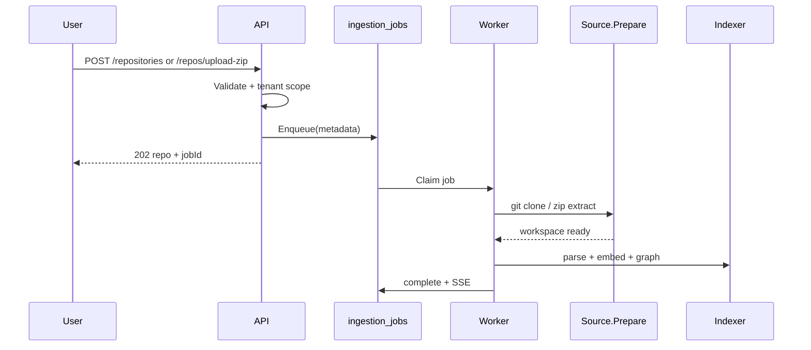

# Multi-provider repository ingestion

Production-oriented design for GitHub, GitLab, Bitbucket, and ZIP uploads through one pipeline.

## Why this scales

- **Provider logic is isolated** behind `repositorysource.Provider` and `vcsauth`; the indexer, graph builder, and job queue never import GitHub/GitLab SDKs.
- **Tenants are first-class** (`tenant_id` on repositories, tokens, jobs) so stateless API replicas share Postgres + Redis only.
- **Ingestion is event-driven** via `ingestion_jobs` (durable queue) and optional Redis SSE — horizontal scale = more workers, not bigger monoliths.
- **Credentials are encrypted at rest** and never accepted in clone URLs from clients (SSRF-safe URL validation unchanged).

## Architecture



## Unified abstraction

`repositorysource.Provider` (alias concept: RepositorySource):

| Method | Purpose |
|--------|---------|
| `Authenticate` | Validate PAT/OAuth token or no-op for zip |
| `ListRemoteRepositories` | Browse repos after connect |
| `PrepareWorkspace` | Clone or extract into tenant workspace |
| `Provider` / `SourceType` | `github` \| `gitlab` \| `bitbucket` \| `zip` |

`repoingest.Service` remains the **single orchestrator**: create row → enqueue job → worker runs `Prepare` → indexer → socio.

## Ingestion pipeline



## Data model

| Table | Role |
|-------|------|
| `repositories` | Canonical repo (existing) |
| `repo_sources` | External id, provider, link to token |
| `provider_tokens` | Encrypted OAuth/PAT per tenant + user |
| `ingestion_jobs` | Queue + `metadata` JSON (source_type, token_id, zip path) |

`ingestion_jobs.metadata` is the **RepoIngestEvent** payload:

```json
{
  "sourceType": "github",
  "sourceUrl": "https://github.com/org/repo",
  "branch": "main",
  "providerTokenId": "uuid",
  "tenantId": "t1",
  "userSubject": "user@tenant"
}
```

## Security

- OAuth **state** HMAC + TTL in `oauth_states` table
- Tokens: **AES-256-GCM** with `TOKEN_ENCRYPTION_KEY`
- ZIP: zip-slip protection, symlink/device rejection, size/file caps (config)
- Git URLs: no embedded credentials; clone uses server-built auth header
- Rate limits: existing per-route limiter on `/repositories`

## API surface

| Endpoint | Notes |
|----------|-------|
| `GET /auth/{provider}/connect` | OAuth redirect |
| `GET /auth/{provider}/callback` | OAuth callback |
| `POST /auth/{provider}/token` | Store PAT/app password |
| `GET /auth/providers` | Connection status |
| `GET /auth/{provider}/repositories` | List remote repos |
| `POST /repositories` | Unified create (existing) |
| `POST /repos/upload-zip` | Alias multipart zip |
| `POST /repos/sync` | Reindex alias |
| `GET /ingestion/jobs/{jobId}` | Job status by UUID |
| `GET /repositories/{id}/ingestion/status` | Per-repo status (existing) |

## Scaling limits

| Limit | Default | Config |
|-------|---------|--------|
| ZIP upload | 100 MB | `ZIP_MAX_BYTES` |
| ZIP files | 5,000 | `ZIP_MAX_FILES` |
| Single file (index) | 5 MB | `MAX_INDEX_FILE_BYTES` |
| Repo total (index) | 500 MB | `MAX_REPO_BYTES` |
| Worker concurrency | 2 | `INGEST_WORKER_CONCURRENCY` |

## Production deployment

- Set `TOKEN_ENCRYPTION_KEY` (32-byte base64) and provider OAuth client IDs/secrets
- Run **migrate job** before API replicas (`/app/migrate`)
- Shared `WORKSPACE_ROOT` volume or object storage adapter (future: S3 `StorageProvider`)
- `REDIS_URL` for multi-replica SSE and rate limits
- Observability: OpenTelemetry on HTTP + DB + AI (existing)

## Provider coupling

Core pipeline imports only `repoingest` + `repositorysource`. Adding a provider = new `repositorysource` adapter + `vcsauth` OAuth client + allowlist entry in `urlvalidate.go` — no changes to indexer/graph.
