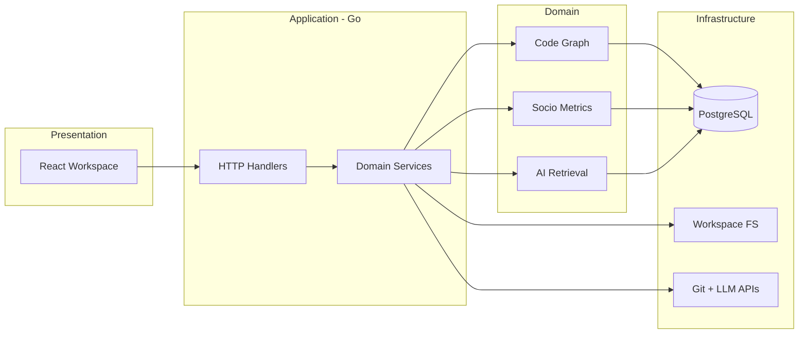

# System Overview

## Business purpose

Engineering teams lose architectural context as repositories grow: ownership blurs, dependencies tangle, and PR/issue history is disconnected from the code graph. CodeAtlas targets **architecture intelligence**—a living map of modules, dependencies, ownership risk, and change hotspots—so teams can answer:

- What breaks if we change module X?
- Who owns this file, and is bus factor dangerously low?
- Where is churn concentrated (hotspots)?
- What did past engineering discussion imply about this area? *(Phase 2—schema present)*

**Problem solved:** Fragmented views (Git UI, static diagrams, generic LLM chat without repo structure). CodeAtlas unifies **structure + history + AI context** on one graph.

## Product positioning (from implementation)

CodeAtlas is **not**:

- AI documentation generation only
- A replacement IDE / Copilot
- A raw graph database explorer

CodeAtlas **is**:

- Graph-backed architecture exploration
- Socio-technical enrichment on the same graph
- RAG chat grounded in dependencies and file metrics

## Repository layout

```
codeatlas/
├── apps/
│   ├── api/          # Go HTTP API + indexer CLI (primary backend)
│   ├── web/          # React SPA (primary UI)
│   └── ai/           # Python FastAPI stub (health endpoint only)
├── packages/
│   ├── shared-types/ # Cross-layer TypeScript contracts
│   └── graph-core/   # Pure TS graph helpers
├── infra/docker/postgres/init/  # pgvector extension on first boot
├── docs/             # This documentation set
├── docker-compose.yml
├── Makefile
├── turbo.json
└── pnpm-workspace.yaml
```

## Runtime components

| Component | Default port | Process |
|-----------|--------------|---------|
| Web (Vite) | 5173 | `pnpm --filter @codeatlas/web dev` |
| Go API | 8080 | `go run ./cmd/server` in `apps/api` |
| Python AI | 8001 | `uvicorn` in `apps/ai` *(optional; not used by chat)* |
| PostgreSQL | 5432 | `docker compose up postgres` |

## Layered architecture



## Ingestion phases (socio-technical)

Documented in `internal/socio/types.go`:

| Phase | Constant | Status in code |
|-------|----------|----------------|
| GitHub history | `github_history` | **Implemented** — `ingestion.RunPhase1GitHubHistory` |
| Engineering memory | `engineering_memory` | Schema + UI placeholder; ingestion **not wired** |
| Operational intel | `operational_intel` | `ci_runs` table; ingestion **not wired** |

## Progressive enrichment UX

1. User submits repo → `POST /repositories` → background clone/index.
2. UI polls `GET /repositories/{id}/progress` and shows partial graph when `filesIndexed > 0`.
3. On `ready`, socio Phase 1 runs in a **goroutine** (`repoingest.runSocioEnrichment`).
4. UI polls `GET /repositories/{id}/ingestion/status` for combined code + socio completeness.

**Why:** Large repos stay interactive while embeddings and GitHub API work continue in the background.

## Key entrypoints

| Entry | File |
|-------|------|
| API server | `apps/api/cmd/server/main.go` |
| CLI indexer | `apps/api/cmd/indexer/main.go` |
| Web app | `apps/web/src/main.tsx` → `App.tsx` |
| Migrations | `apps/api/migrations/*.up.sql` |

## Assumptions (not enforced in code)

- Single-tenant or trusted-network deployment unless you add auth at the edge.
- TypeScript-heavy repos for best indexer results (Tree-sitter TS parser is the MVP).
- GitHub socio sync requires `GITHUB_TOKEN` with repo read access.

See also: [data-flow.md](./data-flow.md), [decisions.md](./decisions.md), [sequence-diagrams.md](./sequence-diagrams.md).
