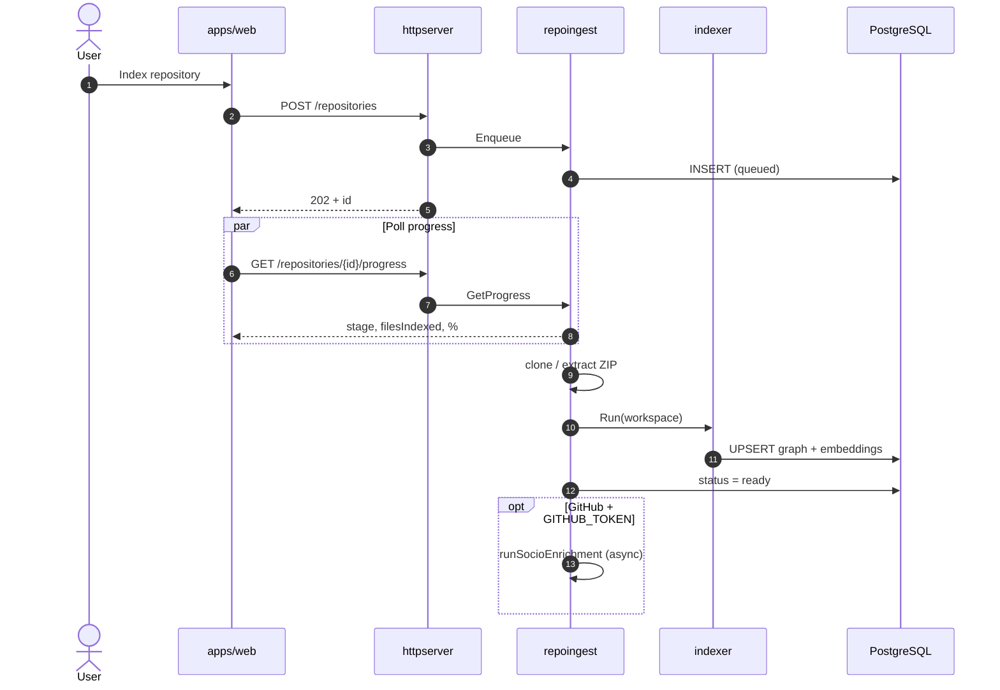
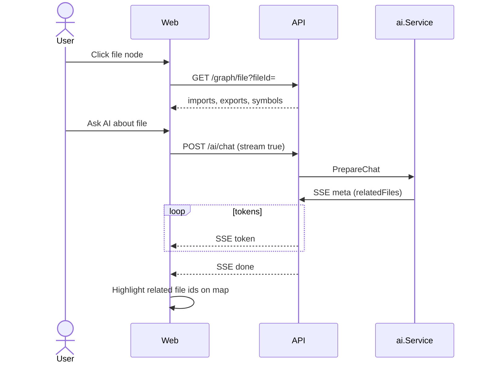
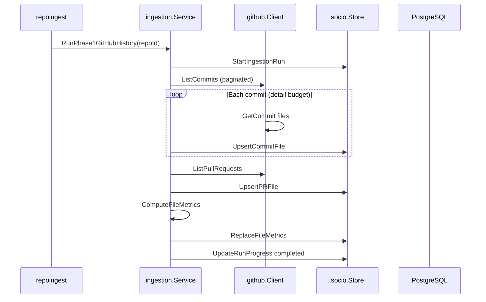
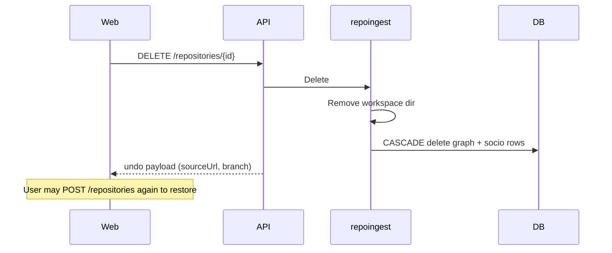

# Sequence Diagrams (Critical Flows)

## Repository ingest + index

```mermaid
sequenceDiagram
  autonumber
  actor User
  participant Web as apps/web
  participant API as httpserver
  participant RI as repoingest
  participant IDX as indexer
  participant DB as PostgreSQL

  User->>Web: Index repository
  Web->>API: POST /repositories
  API->>RI: Enqueue
  RI->>DB: INSERT (queued)
  API-->>Web: 202 + id

  par Poll progress
    Web->>API: GET /repositories/{id}/progress
    API->>RI: GetProgress
    RI-->>Web: stage, filesIndexed, %
  end

  RI->>RI: clone / extract ZIP
  RI->>IDX: Run(workspace)
  IDX->>DB: UPSERT graph + embeddings
  RI->>DB: status = ready

  opt GitHub + GITHUB_TOKEN
    RI->>RI: runSocioEnrichment (async)
  end
```

## File selection → inspector → AI

```mermaid
sequenceDiagram
  actor User
  participant Web
  participant API
  participant AI as ai.Service

  User->>Web: Click file node
  Web->>API: GET /graph/file?fileId=
  API-->>Web: imports, exports, symbols
  User->>Web: Ask AI about file
  Web->>API: POST /ai/chat (stream true)
  API->>AI: PrepareChat
  AI->>API: SSE meta (relatedFiles)
  loop tokens
    API-->>Web: SSE token
  end
  API-->>Web: SSE done
  Web->>Web: Highlight related file ids on map
```

## Socio Phase 1 GitHub sync

```mermaid
sequenceDiagram
  participant RI as repoingest
  participant Ing as ingestion.Service
  participant GH as github.Client
  participant ST as socio.Store
  participant DB as PostgreSQL

  RI->>Ing: RunPhase1GitHubHistory(repoId)
  Ing->>ST: StartIngestionRun
  Ing->>GH: ListCommits (paginated)
  loop Each commit (detail budget)
    GH->>GH: GetCommit files
    Ing->>ST: UpsertCommitFile
  end
  Ing->>GH: ListPullRequests
  Ing->>ST: UpsertPRFile
  Ing->>Ing: ComputeFileMetrics
  Ing->>ST: ReplaceFileMetrics
  Ing->>ST: UpdateRunProgress completed
```

## Delete repository with undo hint

```mermaid
sequenceDiagram
  participant Web
  participant API
  participant RI as repoingest

  Web->>API: DELETE /repositories/{id}
  API->>RI: Delete
  RI->>RI: Remove workspace dir
  RI->>DB: CASCADE delete graph + socio rows
  API-->>Web: undo payload (sourceUrl, branch)
  Note over Web: User may POST /repositories again to restore
```
