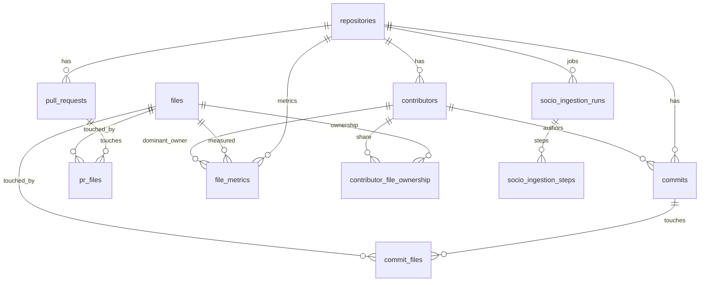
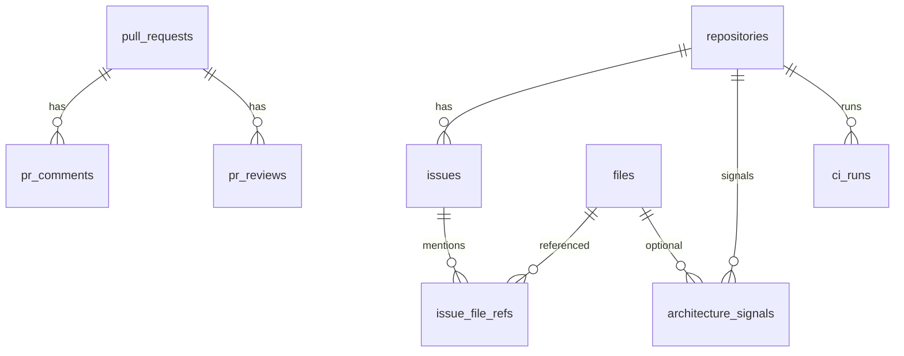

# Entity Relationship Diagram

## Core code graph

```mermaid
erDiagram
  repositories ||--o{ files : contains
  files ||--o{ symbols : defines
  files ||--o{ file_imports : imports
  files ||--o{ file_exports : exports
  files ||--o{ file_dependencies : from
  files ||--o{ file_dependencies : to
  repositories ||--o{ entity_embeddings : scopes
  files ||--o{ entity_embeddings : embeds
```

## Socio-technical (Phase 1)



## Phase 2/3 (tables present)



## ID types

| Domain | PK type |
|--------|---------|
| repositories, files, symbols | BIGINT |
| contributors, commits, PRs, runs | UUID |

Joins always use `files.id` (BIGINT) when linking socio data to the code graph.
