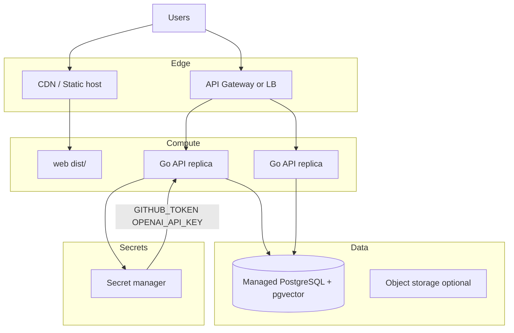
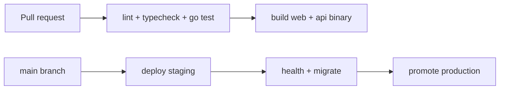

# Deployment (Assumptions)

> **Important:** This repository does **not** include production Dockerfiles, Kubernetes manifests, Terraform, or CI workflows. The following describes a **recommended** deployment model consistent with the codebase.

## Target production architecture

## Component packaging

| Artifact | Build command | Deploy as |
|----------|---------------|-----------|
| Web | `pnpm --filter @codeatlas/web build` | Static files (S3, Netlify, nginx) |
| API | `go build -o server ./cmd/server` | Container or VM process |
| DB | — | Managed Postgres 16+ with `vector`, `pgcrypto` |

**Python `apps/ai`:** Not required for current features.

## Environment (production)

| Variable | Required | Notes |
|----------|----------|-------|
| `DATABASE_URL` | Yes | TLS connection string |
| `HTTP_ADDR` | Yes | e.g. `:8080` behind reverse proxy |
| `CORS_ALLOWED_ORIGINS` | Yes | Production web origin(s) |
| `WORKSPACE_ROOT` | Yes | Writable volume for clones |
| `MIGRATIONS_DIR` | Yes | Bake migrations into image |
| `OPENAI_API_KEY` | Recommended | Real embeddings + chat |
| `GITHUB_TOKEN` | For socio | Fine-scoped PAT or GitHub App |
| `ZIP_MAX_BYTES` / `ZIP_MAX_FILES` | Recommended | Abuse protection |

## Database

- Run migrations on deploy **before** traffic (API also migrates on boot—prefer explicit job in prod).
- Enable backups and PITR.
- Size for: graph rows + vectors (1536-dim typical for OpenAI small) + socio history.

## Scaling

| Layer | Strategy |
|-------|----------|
| API | Horizontal replicas; **stateless** except `WORKSPACE_ROOT` → use shared NFS/EFS or object-store refactor |
| Postgres | Read replicas for analytics; primary for writes |
| Ingest | Long jobs block goroutines—not separate queue yet; consider worker pool + job table |
| GitHub API | Rate limits → backoff already in client; shard tokens per org |

## CI/CD (not in repo — recommended)

Suggested GitHub Actions jobs:

1. `pnpm install`, `pnpm lint`, `pnpm typecheck`
2. `go test ./...` in `apps/api`
3. Build and push API container
4. Upload `apps/web/dist` to static hosting

## Security at edge

Because the API has **no built-in auth**:

- Terminate TLS at load balancer
- Require API key or OIDC at gateway
- Restrict network (VPC, private link to DB)
- Never expose Postgres publicly

## Observability (production)

- Ship JSON logs to centralized stack (Datadog, CloudWatch, ELK)
- Metrics: ingest duration, index file counts, GitHub rate-limit headers, chat latency
- Alerts: `status=failed`, socio run `failed`, DB connection errors

## Rollback

- Keep previous API binary + down migrations only when schema backward compatible
- `*.down.sql` files exist for 0002–0006
