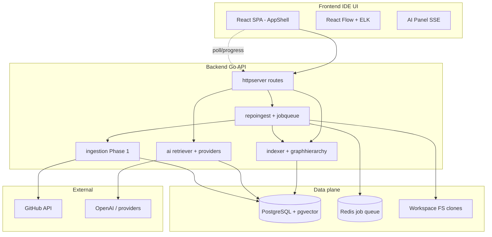
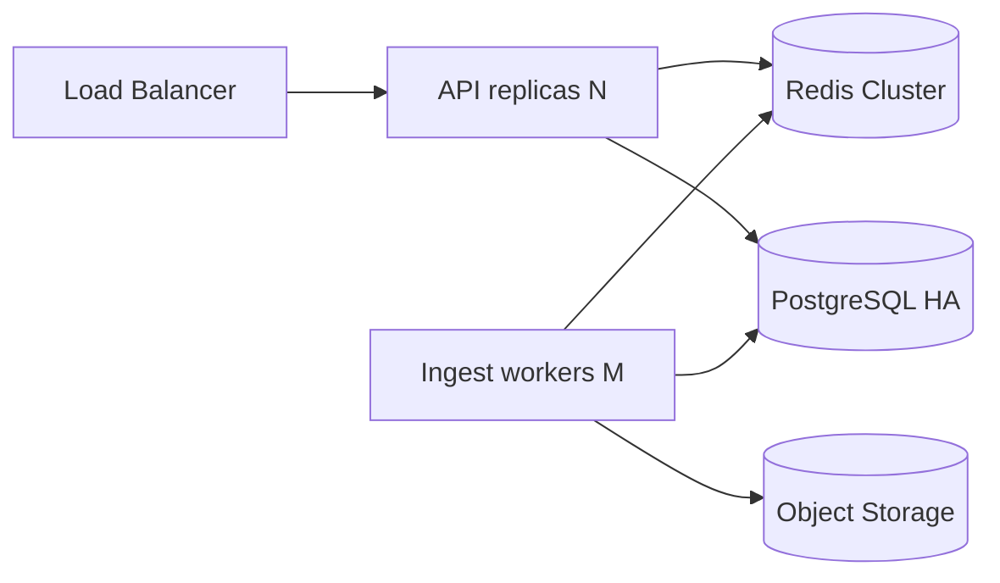
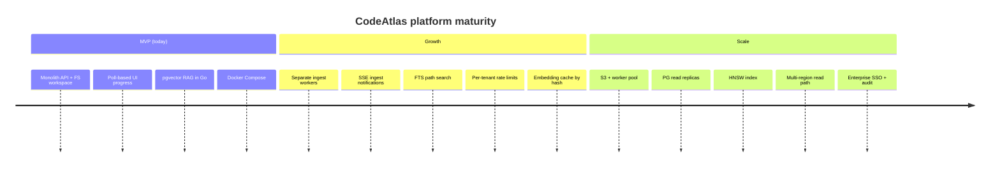

# CodeAtlas Platform Architecture (Staff+ View)

This document describes the **production-oriented architecture** of CodeAtlas as implemented today in the monorepo (`apps/api`, `apps/web`, `packages/*`), with explicit tradeoffs, failure modes, and a recommended evolution path from MVP → Growth → Scale.

**Ground truth (May 2026):** Go 1.23 HTTP API, React 19 + Vite SPA, PostgreSQL 16 + **pgvector**, **Redis** (job queue backing), workspace filesystem for clones, Tree-sitter indexer (CGO) with regex fallback, socio Phase 1 (GitHub history), in-process Graph RAG chat (OpenAI recommended). Python `apps/ai` is a **health stub only**.

---

## Executive summary

CodeAtlas is an **architecture intelligence platform**: ingest repositories, build a **semantic dependency graph**, enrich it with **socio-technical signals** (ownership, churn, hotspots), and let engineers explore impact through an **IDE-like UI** and **graph-grounded AI**.

The current architecture optimizes for **fast time-to-value on a single cluster** (Docker Compose, one API process, DB as source of truth) rather than multi-region elastic scale. That is appropriate for MVP and early design partners; scale-out paths are documented below.

---

## 1. Frontend IDE UI

### Why it exists

Engineers reason in **spatial, navigable workspaces** (files, map, inspector, commands)—not raw JSON APIs. The UI must feel like a lightweight IDE focused on **architecture**, not editing.

### Problem solved

Unifies repository selection, **prefix-based architecture map**, socio views (hotspots, ownership, teams), inspector, AI chat, and command/quick-open palettes into one **AppShell** (`apps/web/src/components/shell/AppShell.tsx`).

### What breaks without it

Users would depend on curl/SQL; no progressive enrichment UX (partial graph while indexing); no blast-radius or hotspot visualization.

### Tradeoffs

| Choice | Benefit | Cost |
|--------|---------|------|
| React SPA (Vite) | Fast iteration, rich graph libs | No SSR; SEO irrelevant for internal tool |
| Zustand store | Simple cross-panel state | Docs still mention older `useState`-only pattern in places |
| Client-side ELK layout | Server stays stateless | CPU spikes on large layers in-browser |
| Polling for ingest progress | Simple vs WebSockets | Extra API load; 1–5s latency on status |

### Scalability limits

- Single user's browser memory for large React Flow graphs.
- No virtualization of huge file lists in quick-open (cap ~24 results today).

### Failure modes

- API offline → degraded status bar, empty graph.
- Stale cluster layer after reindex until user refreshes or sync runs.
- Layout thrash if user navigates prefixes faster than debounced fetches (partially mitigated by loading flags).

### Alternatives considered

- **VS Code extension** — deeper editor integration, slower distribution.
- **Notebook/Jupyter** — poor fit for dependency maps.
- **Server-driven UI** — operational complexity for marginal gain at MVP.

### MVP → Growth → Scale

| Stage | UI |
|-------|-----|
| MVP | Monolithic SPA, polling, local command palette |
| Growth | WebSocket/SSE for ingest; virtualized quick-open; service worker for offline docs |
| Scale | Split graph renderer worker (WASM/canvas); CDN static assets; feature flags |

---

## 2. Repository filesystem layer

### Why it exists

Indexing requires **materialized source trees** (clone/extract) for Tree-sitter and path resolution.

### Problem solved

`repoingest` writes to `WORKSPACE_ROOT` (default `./workspace` or `/app/workspace` in Docker) per repository source (`github`, `gitlab`, `bitbucket`, `zip`).

### What breaks without it

No parseable files on disk → empty graph, failed ingest.

### Tradeoffs

| Choice | Benefit | Cost |
|--------|---------|------|
| Local/ephemeral FS per API pod | Simple, fast I/O | Not horizontally scalable without shared volume |
| Same process as HTTP | No extra worker deploy | Long indexes contend with API latency |
| URL validation (`urlvalidate.go`) | SSRF mitigation | Must maintain allowlists |

### Scalability limits

- Disk per node; clone size = largest customer repo.
- Concurrent ingests bounded by `INGEST_WORKER_CONCURRENCY` (default 2).

### Failure modes

- Disk full → clone fails, `status=failed`.
- Private repo without token → auth errors on clone.
- Orphan workspaces after crash → manual cleanup.

### Alternatives

- **Object storage + ephemeral job pods** (recommended at scale).
- **Remote LSIF/Code Intelligence** — less control over socio coupling.

---

## 3. Graph visualization

### Why it exists

Dependencies are **relational**; tables alone do not convey blast radius or cluster density.

### Problem solved

`GET /graph/clusters` returns clusters + files + edges for a **path prefix**. `GraphCanvas` + ELK render an explorable map; inspector loads `GET /graph/file`.

### What breaks without it

Teams revert to generic diagrams that drift from code.

### Tradeoffs

| Choice | Benefit | Cost |
|--------|---------|------|
| Prefix layers vs full repo graph | Bounded payload & layout time | User must drill into folders |
| Aggregated edges between clusters | Readable high-level map | Loses per-edge detail until zoom |
| Socio overlay on nodes | Hotspot/owner at a glance | More client normalization |

### Scalability limits

- Handler timeout (~60s) on heavy prefixes.
- ELK on thousands of nodes in one layer is prohibitive.

### Failure modes

- Partial index → sparse map with `partialDataWarning`.
- Layout failure → fallback positions or empty canvas message.

### Alternatives

- **WebGL force graph** for huge graphs.
- **Precomputed layout in DB** — faster render, stale on change.

---

## 4. AI chat + context (Graph RAG)

### Why it exists

Natural language questions ("what breaks if we change auth?") require **retrieved, structured context**—not whole-repo prompts.

### Problem solved

`internal/ai`: embed query → pgvector semantic seeds → BFS on `file_dependencies` → merge socio (owner, risk, churn) → token-budget prompt → SSE stream (`POST /ai/chat`).

### What breaks without it

Generic LLM answers hallucinate modules and owners.

### Tradeoffs

| Choice | Benefit | Cost |
|--------|---------|------|
| In-process Go (not Python `apps/ai`) | One deployable, shared DB pool | Tighter coupling to API release cycle |
| Top-K + expansion cap | Controllable latency/cost | May miss distant but relevant files |
| Multiple providers + fallback | Resilience | Config surface area |

### Scalability limits

- Embedding dimension storage grows O(files).
- Each chat = embed + vector search + SQL + LLM tokens.

### Failure modes

- Missing `OPENAI_API_KEY` → degraded/stub provider.
- Empty embeddings → retrieval returns thin context.
- Provider rate limits → SSE `error` event, 502.

### Alternatives

- **Dedicated retrieval service** with cache.
- **Graph-native LLM** (fine-tuned on dependency DSL) — research-heavy.

### Cost considerations (AI)

| Cost driver | Mitigation today | At scale |
|-------------|----------------|----------|
| Per-file embeddings on index | Optional; tied to index job | Hash-based skip if unchanged |
| Per-chat embed + completion | Context token budget | Cache query embeddings; cheaper router model |
| Re-index on every commit | Full reindex path | Incremental index + delta embeddings |

**Rule of thumb:** At 10k files × 1.5k tokens embedding ≈ significant one-time cost; chat cost dominates active teams unless embeddings are cached/deduped.

---

## 5. Realtime sync

### Why it exists

Ingest and socio jobs are **long-running**; the UI must reflect progress without blocking.

### Problem solved (today)

**Not true realtime push** — client **polls**:

- `GET /repositories/{id}/progress` (code index)
- `GET /repositories/{id}/ingestion/status` (socio + combined completeness)
- Repository list refresh via `useBackend` hook
- Manual **Refresh repository data** command triggers `syncActiveRepository`

Post-ready socio Phase 1 runs in a **goroutine** (`runSocioEnrichment`).

### What breaks without it

Users assume failure when the map is still indexing.

### Tradeoffs

| Choice | Benefit | Cost |
|--------|---------|------|
| Polling | Simple, works through corporate proxies | Latency, duplicate requests |
| SSE only for chat tokens | Fits streaming LLM | Inconsistent transport story |

### Failure modes

- Poll storm if interval too aggressive on many tabs.
- Missed terminal state if poll stops before `ready`.

### Alternatives (recommended Growth)

- **SSE or WebSocket channel** per `repositoryId` for ingest events.
- **Redis pub/sub** fanout to all API replicas.

---

## 6. Backend (Go API)

### Why it exists

Single **authoritative orchestration** for auth, ingest, graph, socio, AI, metrics.

### Problem solved

`cmd/server/main.go`: migrate DB, wire stores, start HTTP server, start ingestion worker consuming Redis queue.

### What breaks without it

No security boundary, no job orchestration, no graph API.

### Tradeoffs

| Choice | Benefit | Cost |
|--------|---------|------|
| Monolith Go service | Low ops burden | Blast radius of deploy |
| `http.ServeMux` Go 1.22+ patterns | Clear routing | No grpc for internal services yet |
| JWT auth (`internal/auth`) optional via `AUTH_DISABLED` | Production path exists | Bootstrap secret discipline required |
| Rate limiting / metrics middleware | Abuse protection | Tuning per tenant |

### Scalability limits

- Vertical scale first; worker concurrency semaphore.
- Workspace FS affinity pins workloads to nodes.

### Failure modes

- Migration failure on boot → process exit (fail-fast, good).
- Worker panic → job marked failed in queue.
- GitHub API rate limit → socio steps fail with metadata.

### Alternatives

- **Split ingest worker Deployment** (recommended Scale).
- **BFF per client** — only if mobile/public API diverges.

---

## 7. Search

### Why it exists

Users find **files** (paths) and **commands** (views/actions) faster than clicking sidebars.

### Problem solved (today)

| Surface | Mechanism |
|---------|-----------|
| Quick Open (⌘P) | Client fuse.js over `clusterLayer.files` + hotspots |
| Command palette (⌘⇧P / ⌘K) | fuse.js over commands; recent commands in `localStorage` |
| Architecture map filter | In-graph search (file node visibility) |
| AI retrieval | pgvector semantic search + graph expansion |

**No dedicated full-text search engine** (Elasticsearch/OpenSearch) in repo today.

### What breaks without it

Large repos: palette caps results; no cross-repo search.

### Tradeoffs

| Choice | Benefit | Cost |
|--------|---------|------|
| Client-side fuzzy | Zero infra | No global index; stale until graph loaded |
| pgvector for AI only | Unified DB | Not optimized for path substring |

### Failure modes

- Empty `clusterLayer` → quick open shows no files.
- Embedding index lag → AI search weaker than path search.

### Alternatives

- **Postgres FTS** on `files.path` for quick open at scale.
- **Zoekt/Sourcegraph** — powerful, heavy ops.

---

## 8. Scalability

### Current topology (Docker Compose)

`postgres` (pgvector), `redis`, `api`, `web` (nginx static).

### Horizontal scaling blockers

1. **Workspace FS** on local disk per API instance.
2. **In-process worker** tied to API lifecycle (worker exists in `jobqueue` but shares process).
3. **No embedding cache** keyed by content hash.
4. **Single DB** write path for all tenants (tenant scope migration `0010_tenant_scope` indicates direction).

### Recommended Scale topology

| Layer | Scale tactic |
|-------|----------------|
| API | Stateless replicas; JWT; shared Redis |
| Ingest | Dedicated workers; claim jobs from Redis; clone to S3 |
| DB | Read replicas for graph reads; pgvector HNSW/IVFFlat |
| AI | Queue embedding jobs; batch OpenAI calls |
| Web | CDN + `VITE_API_URL` to API gateway |

---

## 9. Performance and latency

### Hot paths

| Path | Dominant cost |
|------|----------------|
| `GET /graph/clusters` | SQL aggregation + JSON serialize |
| Index job | Parse × files + optional embed |
| Chat first token | Embed + vector query + LLM TTFB |
| ELK layout | Client CPU |

### Targets (product SLOs — aspirational)

| Interaction | MVP observed | Growth target |
|-------------|--------------|---------------|
| Map open (warm prefix) | 200ms–2s | p95 < 800ms |
| Quick open keystroke | < 16ms fuzzy | same |
| Chat TTFB | 1–5s+ | p95 < 2s with cache |

### Implemented mitigations

- Prefix-scoped graph layers.
- Retrieval caps (`limit`, BFS cap).
- `AI_CONTEXT_TOKEN_BUDGET`.
- Ingest concurrency limit.
- Partial graph when `filesIndexed > 0`.

---

## 10. Failure modes (platform-level)

| Event | User impact | System behavior | Recovery |
|-------|-------------|-----------------|----------|
| Postgres down | Total outage | API won't start / 5xx | Fail-fast; restore backup |
| Redis down | Ingest queue stuck | Dequeue errors logged | Fall back to DB job table or sync ingest |
| GitHub rate limit | Socio incomplete | Step failure metadata | Retry with backoff |
| Indexer parse error per file | Local gap in graph | Log + continue | Reindex file on fix |
| LLM outage | Chat errors | SSE error / 502 | Provider fallback chain |
| Disk full | Ingest fails | `failed` status | Expand volume; cleanup workspace |
| Auth misconfig | 401 for tenants | `AUTH_DISABLED` false without secret | Fix `JWT_SECRET` |

**Cascades to avoid:** Do not let chat traffic starve ingest CPU on same process—split workers at Growth.

---

## Evolution: MVP → Growth → Scale

---

## Cost considerations (summary)

| Area | Driver | Control knob |
|------|--------|--------------|
| AI embeddings | Files × reindex | Incremental index, skip unchanged |
| AI chat | Users × queries × context size | Token budget, smaller models for triage |
| GitHub API | Commits/files scanned | Phase budgets (400 commit detail cap today) |
| Compute | Index CPU | Worker autoscaling separate from API |
| Storage | PG rows + workspace | Retention, zip ingest vs full history |

---

## What I would NOT build (yet)

1. **Custom graph database** — Postgres adjacency + materialized layers is enough until billions of edges.
2. **Real-time collaborative cursors** — high complexity; low ROI for architecture map.
3. **Python microservice for chat** — duplicate retrieval logic; current Go path is correct.
4. **Full IDE / LSP server** — scope creep vs Copilot/VS Code.
5. **Multi-model agent orchestration framework** — start with one strong RAG path + evals.
6. **Engineering memory LLM pipeline** before Phase 1 socio is reliable in production.

---

## Recommended final architecture

For a **production SaaS** serving many mid-size repos:

1. **Edge:** CDN + WAF → **API gateway** (auth, rate limit, tenant routing).
2. **Services:** Stateless **API** + **Ingest workers** + optional **Embedding worker**.
3. **Data:** PostgreSQL (pgvector, tenancy RLS), Redis (queue + pub/sub), S3 (clones/artifacts).
4. **Search:** PG FTS for paths; pgvector for semantic; optional OpenSearch only at enterprise tier.
5. **Observability:** Prometheus metrics (`httpserver/metrics.go`), structured logs, trace ingest→index→embed.
6. **AI:** Provider abstraction stays in Go; cost dashboards per tenant; cached embeddings.

The **frontend remains a rich SPA** with optional WebSocket progress; **graph layout stays client-side** until layer sizes force server-side layout cache.

---

## Related documentation

| Topic | Path |
|-------|------|
| System overview | [architecture/overview.md](./architecture/overview.md) |
| Backend packages | [backend/overview.md](./backend/overview.md) |
| AI / RAG | [backend/ai-layer.md](./backend/ai-layer.md) |
| Socio ingestion | [backend/ingestion-socio.md](./backend/ingestion-socio.md) |
| Performance notes | [architecture/performance-and-scaling.md](./architecture/performance-and-scaling.md) |
| Observability | [operations/observability.md](./operations/observability.md) |
| Deployment | [deployment/production.md](./deployment/production.md) |

---

*This document is the Staff+ architecture brief for CodeAtlas. Update it when major boundaries move (e.g. ingest worker split, WebSocket progress, dedicated search).*
