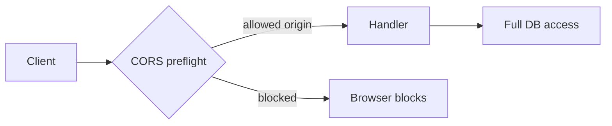

# Security

## Authentication and authorization

### Current state (code-verified)

| Capability | Implemented? |
|------------|----------------|
| User login / SSO | **No** |
| API keys / JWT validation | **No** |
| Role-based access | **No** |
| Repository-level ACL | **No** |

The Go API serves all routes to any client that can reach `HTTP_ADDR`. Browser access is limited by **CORS origin allowlist** only—not a security boundary for non-browser clients.

**Implication:** Deploy behind a trusted network or add an API gateway before internet exposure.

### Authorization flow

*There is no per-user authorization step.*

## Secrets management

| Secret | Usage | Storage |
|--------|-------|---------|
| `DATABASE_URL` | Postgres credentials | Env / secret manager |
| `OPENAI_API_KEY` | Embeddings + chat | Env only—never commit |
| `GITHUB_TOKEN` | GitHub REST | Backend only—never sent to web |
| `ANTHROPIC_*`, `GEMINI_*`, etc. | Optional providers | Env |

**Frontend:** No LLM or GitHub tokens in Vite env (only `VITE_*` public vars).

## CORS

`internal/httpserver` — `withCORS`:

- Allowed origins from `CORS_ALLOWED_ORIGINS`
- Methods: GET, POST, DELETE, OPTIONS
- Headers include `Authorization` (unused by server today)

## Input validation

| Surface | Controls |
|---------|----------|
| ZIP upload | `ZIP_MAX_BYTES` (default 100MB), `ZIP_MAX_FILES` (5000) |
| Repository id | Parsed as int64, must be > 0 |
| Git URLs | Validated during clone; socio parses GitHub host only |
| SQL | Parameterized queries via pgx |

**Gaps:** No virus scanning on ZIP; no content security policy headers documented in code.

## Data isolation

- Single database; repositories isolated by `repository_id` FK.
- **No multi-tenant hardening** (cross-repo ID guessing possible if API is public).

## GitHub token scope

Use minimum scope: read access to targeted repositories (or org). Token stays server-side in `internal/github`.

## LLM data handling

- Retrieved file paths and metadata sent to configured provider.
- **Assumption:** Treat as sensitive if repo is private—review provider data policies.
- No PII redaction layer in code.

## Dependency security

- Go modules: `go.sum` pinned
- pnpm lockfile: `pnpm-lock.yaml`
- Run `govulncheck`, `pnpm audit` in CI (recommended—not in repo)

## Hardening checklist (recommended)

- [ ] Add API authentication (JWT or mTLS)
- [ ] Network policies: DB private, API behind LB
- [ ] Rate limit `POST /repositories` and `/ai/chat`
- [ ] Sanitize ZIP paths (zip slip)—verify `ZIPSource` implementation
- [ ] Enable TLS for Postgres
- [ ] Secret rotation for `GITHUB_TOKEN` and LLM keys
