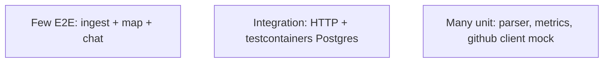

# Testing Strategy

## Current state

| Area | Coverage |
|------|----------|
| Go indexer parser | `parser_test.go` |
| Go indexer resolver | `resolver_test.go` |
| GitHub URL parse | `parse_test.go` |
| Socio percentile math | `metrics_test.go` |
| Frontend | **No automated tests** |
| Python AI | **No tests** |
| HTTP integration | **No tests** |
| E2E | **No Playwright/Cypress** |

Run Go tests:

```bash
cd apps/api
go test ./...
```

## Recommended pyramid



## Unit tests (expand)

| Package | Suggested cases |
|---------|-----------------|
| `socio` | `ComputeFileMetrics` with fixture SQL |
| `graphhierarchy` | Prefix clustering on synthetic deps |
| `ai` | Prompt trimming, importance ranking |
| `github` | Retry on 403 rate limit (httptest) |
| `repoingest` | Status transitions (mock store) |

## Integration tests

- **testcontainers-go** for Postgres + migrations
- Seed minimal repo → index → assert `files` count
- `GET /graph/clusters` JSON shape snapshot

## Frontend tests

- **Vitest** + React Testing Library for `SocioPanels`, `HierarchyGraph` normalize
- Mock `fetch` for API contracts

## Contract tests

- Align `packages/shared-types` with Go JSON tags
- Optional OpenAPI generation from handler structs (not present today)

## CI (not in repo)

Suggested pipeline gates:

1. `go test ./...`
2. `go vet ./...`
3. `pnpm typecheck`
4. `pnpm lint`

## Manual QA checklist

- [ ] Ingest GitHub public repo with `GITHUB_TOKEN`
- [ ] Partial graph during indexing (`filesIndexed > 0`)
- [ ] SSE chat streams tokens
- [ ] Delete + undo restore flow
- [ ] Hotspot badges after socio completes

## Performance testing

- Large repo index: track `indexDurationMs` in `stage_metadata`
- Load test `GET /graph/clusters` with 10k files (expect need for pagination—**not implemented**)
